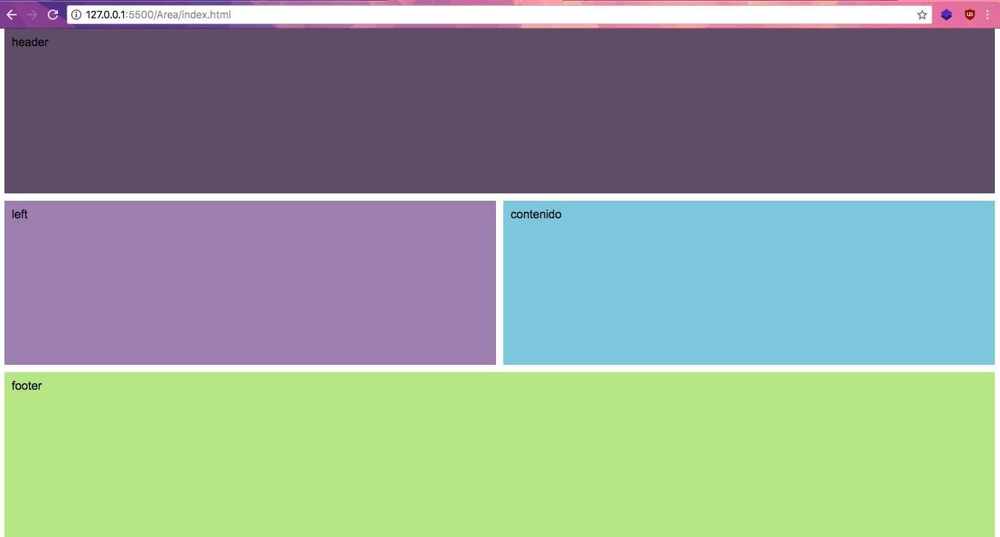

# Curso de CSS Grid Layout


:bowtie:

             F I L A
                C

                O

                L

                U

                M

                N

                A
# **2. Propiedades de CSS Grid Layout**

Clase 2

## ¿Qué es CSS grids?

El diseño de cuadrícula CSS o cuadrícula CSS es una técnica en CSS que permite a los desarrolladores web crear diseños de diseño web complejos y receptivos de forma más fácil y consistente en todos los navegadores.

Clase 3

## Conceptos fundamentales sobre CSS Grid Layout

[Documentación oficial de MDN](https://developer.mozilla.org/es/docs/Web/CSS/CSS_Grid_Layout)

[Otra link](https://css-tricks.com/snippets/css/complete-guide-grid/)

**Grid Container**: va a ser el elemento padre que va a tener puesto un nuevo tipo de display: grid. Nos permite colocar otras propiedades para manipular nuestro layaout.

Ejemplo:

```
<div class="container">
    <div class="item item-1"></div>
    <div class="item item-2"></div>
    <div class="item item-3"></div>
</div>
```

**Grid Item**: Son nuestro componentes, contenido, lo que vamos a manejar. Nuestras filas o columnas que vamos a mover a nuestro gusto. Son hijos directos de grid.

Ejemplo:

```
<div class="container">
    <div class="item"></div>
    <div class="item">
        <p class="sub-item"></p>
    </div>
    <div class="item"></div>
</div>
```

**Grid Line**: Lineas divisorias horizontales y verticales.


**Grid Track**: Espacio entre dos líneas adyacentes. Filas y columnas.


**Grid Cell**: Celdas, espacio en dos filas adyacentes y 2 columnas adyacentes.


**Grid Area**: Espacio rodeado por 4 grid lines


Clase 4

# Definiendo columnas :sunglasses:


Creamos una carpeta "Columna" y dentro "index.html"

Designar columnas :
```
<!DOCTYPE html>
<html lang="en">
<head>
  <meta charset="UTF-8">
  <title>Columnas</title>
  <style>
    body {
      font-family: Arial;
    }
    .container {
      display: grid;
      grid-template-columns: 25% 200px 25%;
    }
    .item {
      background: lightblue;
      padding: 10px;
      border: 1px solid red;
    }
  </style>
</head>
<body>
  <section class="container">
    <div class="item">contenido #1</div>
    <div class="item">contenido #2</div>
    <div class="item">contenido #3</div>
    <div class="item">contenido #4</div>
    <div class="item">contenido #5</div>
    <div class="item">contenido #6</div>
    <div class="item">contenido #7</div>
    <div class="item">contenido #8</div>
    <div class="item">contenido #9</div>
    <div class="item">contenido #10</div>
    <div class="item">contenido #11</div>
    <div class="item">contenido #12</div>
  </section>
</body>
</html>
```

Clase 5 :alien:
# Definiendo filas

Carpeta: "Filas", Archivo: "index.html"

Para definir las filas:

```grid-template-rows: valores;```

Definir filas y columnas:

```grid-template: filas / columnas;```

**grind implicito**: Es cuando tenemos filas y/o columnas que no definimos pero forman parte de nuestro grid

**grid explicito**:  Es cuando definimos el numero de columnas y/o filas.

Clase 6
# Grids identados y tipos de displays :neckbeard:

Carpeta: "Displays", Archivo: "index.html"

Display subgrid para heredar la configuración del grid padre (cuando se esten anidando grids).

```display: subgrid; // No disponible aun```


Display inline-grid muestra el grid en una sola linea:

```display: inline-grid; // No disponible aun```


Clase 7
# Espaciado entre filas y columnas :frowning:

Carpeta: "Displays", Archivo: "index.html"

:warning: Importante: Chrome 66 hizo cambios en css-grid, específicamente en gap y ahora es simplemente gap:

Espaciado entre columnas
```
column-gap: value;
```
Espaciado entre filas
```
row-gap: value;
```
Espaciado entre filas y columnas
```
gap: rows columns;
```
Notas

```grid-column-gap: value;``` Espaciado entre columnas

```grid-row-gap: value;``` Espaciado entre filas

```grid-gap:``` rows columns Espaciado

Clase 8
# Repetidores, unidades de medida y funciones :loudspeaker:
Carpeta: "Funciones", Archivo: "index.html"

Unidad de medida: fracciones `fr` distrubuye el espacio disponible en formas iguales.

Si tenemos tres columnas, y a cada una de ella le asignamos un valor de 1fr, el ancho del grid track vertical se repetirá por igual hasta ocupar el ancho total.

Si en lugar de ser tres columnas con un mismo ancho le asignamos a una de ellas el valor 2fr, esta ocupará el doble de ancho que las columnas a las que le hemos asignado el valor 1fr.

Este valor lo podemos asignar tanto a columnas como a filas.

Funciones:
`repeat(cantidad, valor)` Para usar el mismo valor varias veces

`minmax(min, max)` Agregar un valor minimo y maximo para el tamaño al hacer responsive


Clase 9
# Definiendo áreas de contenido :construction:

Carpeta: "Areas", Archivo: "index.html"


Empezamos !!

¿Cuantas filas y columnas se observan en la siguiente imagen?
Vamos a construir el siguiente grid como ejemplo para conocer algunas propiedades y valores:


Partimos de un html simple.
```
<section class="container">
    <div class="item header">header</div>
    <div class="item left">left</div>
    <div class="item contenido">contenido</div>
    <div class="item footer">footer</div>
</section>
```
En el CSS o en mi caso la etiqueta `<style>`ponemos lo siguiente 

¡Empezamos!
Establecemos las columnas y filas con la propiedad `grid-template`. Esta propiedad se le asigna el `grid` al `container` 

Con la propiedad `grid-template-areas` definimos los nombres de las áreas de contenido.

La propiedad `grid-area asigna` a un `**item**` el nombre de area que creamos con `grid-template-areas` haciendole referencia y así poder utilizarlo.

En el ejemplo `grid-template` ponemos 3 filas `/` 2 columnas y en `grid-template-areas` definimos los nombres y como estaran establecidas cada aréa, mas abajo defino su color y a que aréa pertenece.

```
.container {
      display: grid;
      grid-template: 100px 1fr 150px/ 200px 1fr;
      gap: 10px;
      height: 100vh;
      grid-template-areas: "header header" 
                            "left contenido" 
                            "footer footer";
    }
    .header {
        background-color: #5f4d68;
        grid-area: header;
      }
      .left {
        background-color: #9d7eae;
        grid-area: left;
      }
      .contenido {
        background-color: #7dc7db;
        grid-area: contenido;
      }
      .footer {
        background-color: #b6e585;
        grid-area: footer;
      }
      .item {
      padding: 10px;
      border: 1px;
    }
    .item:nth-of-type(4){
      overflow: auto;
      display: grid;
      grid-template: 50px 50px 50px / 100px 100px 100px;
    }
```
La disposición de los item según el código anterior es la siguiente:



Nota:

 `vh` y `vw`: Las medidas vh y vw son medidas relativas de acuerdo al viewport. `Vh` hace referencia a la centésima parte de la altura del viewport y vw a la centésima parte del ancho del viewport.
- 1vh = 1% de la altura del viewport
- 100vh = altura del viewport
- 1vw = 1% del ancho del viewport
- 100vw = ancho del viewport.

Clase 10 
## Definiendo el tamaño de los columnas dentro de un grid
Carpeta: "Tamaño", Archivo: "index.html"

Si conocemos bien el número de líneas que ocupa cada elemento no hay riesgo a equivocarnos.

Sintaxis sin resumir:
```
grid-column-start: 1;
grid-column-end: 3;
```
Sintaxis resumida:
```
grid-column: 1 / 3;
grid-column: inicio / final;
```

Sintaxis definiendo por líneas:
```
grid-column: 1 / 3;
```
Sintaxis definiendo por columnas:
```
grid-column: 1 / span 2;
```
++Sintaxis para ocupar todo el ancho dinamicamente: ++
```
grid-column: 1 / -1;
```


Nota:

[Para jugar y complementar esta clase](https://cssgridgarden.com/#es)

Clase 11
# Definiendo el tamaño de filas dentro de un grid
```
grid-row-start: valor;
grid-row-end: valor;
```
Igual que las columnas para escribir esto en una sola linea:
```
grid-row: inicio / final;
```
El negativo significa que comienza contando desde el final.
Por ejemplo si quieres que contenga todo el ancho hasta que empieza la ultima columna utilizarías
```
grid-column: 1 / -2;
```
Para definir las columnas utilizamos
```
grid-column-star:1; /*en que columna iniciara nuestor elemento*/
grid-column-end: 3; /*en que columna terminara recordemos que se cuenta desde el primer grid line*/
grid-column: 1/3; /*esta es la forma de agrupar el start y el end en una sola linea de codigo start/end */

grid-column: 2/span 2; /*Con span indicamos los lugares que va a ocupar */
grid-column: 1/-1; /* Con esto lograremos que el elemento ocupe todo el espacio de mis columnas */
```
Para definir filar utilizamos 
```
grid-row-star:1; /*en que fila iniciara nuestor elemento*/
grid-row-end: 3; /*en que fila terminara recordemos que se cuenta desde el primer grid line*/
grid-row: 1/3; /*esta es la forma de agrupar el start y el end en una sola linea de codigo start/end */

grid-row: 2/span 2; /*Con span indicamos los lugares que va a ocupar */
grid-row: 1/-1; /* Con esto lograremos que el elemento ocupe todo el espacio de mis filas*/
```

```
grid-column: [# columna donde inicia] / [#columna donde termina]
```